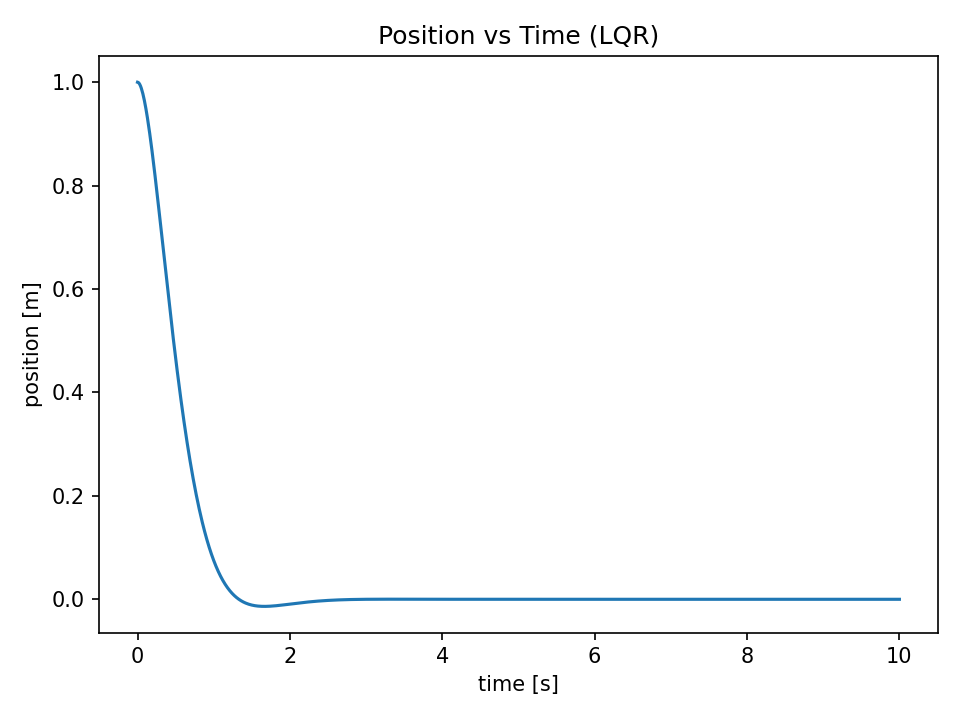

# msd-optimal-control


A minimal, well-documented Python project that demonstrates **optimal control** on a classic **mass–spring–damper (MSD)** system.  
You'll get:

- A reusable MSD environment (`msdcontrol.env.MassSpringDamperEnv`) with continuous- and discrete-time models
- Discrete-time **LQR** (finite- and infinite-horizon) implemented from scratch (`msdcontrol.lqr`)
- A simple simulation/rollout utility (`msdcontrol.sim`)
- A runnable example that plots state and control (`examples/msd_lqr_demo.py`)
- Light dependencies: `numpy`, `scipy` (optional for high-fidelity discretization), `matplotlib`

This makes a clean repo to put on GitHub and extend (e.g., constraints/MPC, disturbance rejection, multi-mass chains, pendulum, cart–pole).

---

## Quickstart

```bash
# (optional) create a venv
python -m venv .venv && . .venv/bin/activate   # on Windows: .venv\Scripts\activate

pip install -r requirements.txt

# run the demo
python -m examples.msd_lqr_demo
```

The demo will print the total quadratic cost and pop up two plots: states and control input over time.

---

## The Model

**State (position and velocity):**

$$
x = \begin{bmatrix} p \\ v \end{bmatrix}, \qquad
p=\text{position},\; v=\text{velocity}.
$$

**Dynamics (continuous time):**

$$
\dot{x} = A x + B u, \qquad
A = \begin{bmatrix} 0 & 1 \\ -\frac{k}{m} & -\frac{c}{m} \end{bmatrix}, \quad
B = \begin{bmatrix} 0 \\ \frac{1}{m} \end{bmatrix}.
$$

We simulate a **discrete-time** model \(x_{k+1} = A_d x_k + B_d u_k\) using Zero-Order Hold (ZOH).
If `scipy.linalg.expm` is present, we use the exact ZOH formulas; otherwise we fall back to forward Euler (good for small \(\Delta t\)).

---

## Optimal Control (LQR)

We solve the discrete-time **Linear Quadratic Regulator** problem:


- **Infinite-horizon LQR** uses a fixed point of the Discrete Algebraic Riccati Equation (DARE). We implement a simple fixed-point iteration (no external control libraries).
- **Finite-horizon LQR** computes a time-varying gain sequence by backward Riccati recursion.

Controller: \(u_k = -K x_k\) (regulation to the origin).

---

## Project Layout

```
msd-optimal-control/
├── msdcontrol/
│   ├── __init__.py
│   ├── env.py        # MassSpringDamperEnv (CT + DT + ZOH/Euler discretization)
│   ├── lqr.py        # DARE solver (iterative), finite-horizon recursion, DLQR
│   └── sim.py        # simulate() utility and helpers
├── examples/
│   └── msd_lqr_demo.py
├── tests/
│   └── test_lqr.py
├── requirements.txt
├── LICENSE
├── .gitignore
└── README.md
```

---

## Extending the Project

- **Constraints / MPC**: add input/state constraints and solve a small QP in a receding horizon loop (e.g., with `osqp`).
- **Integral action**: augment the state with the integral of position to track a non-zero setpoint.
- **Multi-mass chains**: generalize `A, B` to higher-order spring–mass–damper arrays.
- **Nonlinear systems**: implement iLQR for, e.g., a simple pendulum, then reuse the same `simulate()`.

---

## References (friendly starting points)

- Anderson & Moore, *Optimal Control: Linear Quadratic Methods*  
- Bertsekas, *Dynamic Programming and Optimal Control* (vol. 1)  
- Lewis, Vrabie, Syrmos, *Optimal Control* (3rd ed.)

---

## License

MIT — see `LICENSE`.
